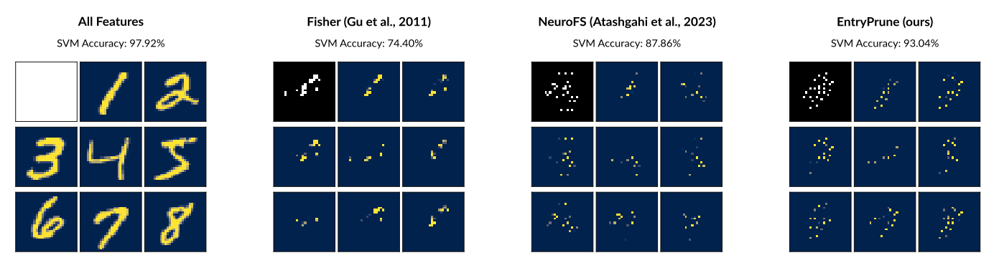



## Current Projects  

Here is an overview of my current projects. If you have any questions or are interested in collaborating with me, please feel free to get in touch at `felix.zimmer@mail.de`.

### **Feature Selection for Neural Networks**  

  

Feature selection is an intriguing problem because it can save a lot of computational resources and help to interpret what prediction algorithms base their decisions on. There are already a number of elegant and successful approaches to feature selection for neural networks. For example, [Lemhadri et al.](https://www.jmlr.org/papers/v22/20-848.html) add a residual connection from the input layer to the output of the network to control which features are active. Another example is [Atashgahi et al.](https://arxiv.org/abs/2303.07200), who perform selection in the context of sparse neural networks by continuously removing and adding input neurons.  

To contribute to this pool of methods, we have developed EntryPrune, a lightweight algorithm that uses a dense neural network with a dynamic sparse input layer ([arXiv:2410.02344](https://arxiv.org/abs/2410.02344)). It employs entry-based pruning, a novel approach that compares neurons based on their relative change induced when they have entered the network. The algorithm is open-sourced as a [Python package](https://github.com/flxzimmer/entryprune). Next steps may involve extending the approach to sparse neural network training or using the proposed metric as a variable importance measure.  

<!-- ### **Sample Size Planning Clinical Prediction Models**  

Once a clinical prediction model has been developed using an initial data set, its predictive performance needs to be validated using new data. The sample size for this validation needs to be planned with the precision of the performance measurement in mind. In recent years, some methods have been proposed to solve this problem. During my current visit with Daniel Stahl at King's College London, we aim to contribute to this growing pool of methods.   -->

## Previous Projects  

### **Sample Size Planning for Complex Study Designs**  

The relationship of sample size and statistical power can be hard to describe mathematically, especially when we look at more complex study designs. Modern designs can have multiple sample sizes, for example for separate arms or stages of a clinical trial. We [developed an approach](https://doi.org/10.31234/osf.io/tnhb2) to estimate the sample sizes in these cases efficiently, while taking the cost of the overall study design into account. Our approach builds on simulations combined with machine learning methods. It's available in an [R package](https://cran.r-project.org/package=mlpwr) along with a [tutorial](https://doi.org/10.31234/osf.io/r9w6t).  

### **Statistical Power Analysis for Item Response Theory Models**  

Some common psychometric models and hypothesis tests lacked formulas to determine statistical power as a function of sample size. We [suggested and evaluated such formulas](https://doi.org/10.1007/s11336-022-09883-5) and made them available in an [R package](https://CRAN.R-project.org/package=irtpwr). These tools enable researchers and practitioners to optimize their study designs and make more informed decisions when applying item response theory models.

### **Applications of Machine Learning in Psychology**  

Machine learning is increasingly becoming a valuable tool for psychological research. In my master's thesis, I summarized the applications along different subfields. Especially in image or text processing, it was found that machine learning - especially deep learning - has great potential. In 2022, I held a seminar focused on the applications of deep learning in psychology ([open materials in German](https://doi.org/10.17605/osf.io/72S6U)).
